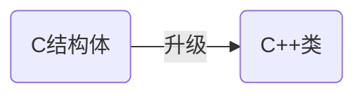

# 🌳类与对象

[toc]


## 🌲什么是类？

类可以比作蓝图，通过类可以造出实物（实例出对象）。

> 把类比作房子的设计图纸，那么对象就是通过图纸造出的房子

## 🌲为什么会出现类？

**类可以看作是C语言结构体的升级版**

C结构体只能放变量不能放函数，类里面既可以放变量也可以放函数

以C结构体为例

```C
struct People
{
    //身高、体重、年龄、性别
    int height;
    int weight;
    int age;
    int sex;
}
```

People这个结构体描述了人的静态属性，<u>如果此时People想吃喝睡呢？</u>

**这个时候便需要类**了，类中的函数就可以描述对象的行为。

```c++
//简单类 demo
class People  //class是类的关键字
{
    //身高、体重、年龄、性别   height weight等就是成员变量
    int height;
    int weight;
    int age;
    int sex;
    
    //吃喝睡  下面的eat、drink、sleep就称为成员函数
    void eat()
    {
        cout<<"i am eating"<<endl;
    }
    void drink()
    {
        cout<<"i am drinking"<<endl;
    }
    void sleep()
    {
        cout<<"i am sleeping"<<endl;
    }
}
```



此外，**C++把struct看作类**，从类的角度看，struct声明变量等同于在类里面声明变量，自然没问题。

同时因为struct被升级为类，所以cpp文件的结构体里也可以放函数


### 🌴C++中结构体的小细节


## 🌲什么是对象？

通过类创建出来的实体就叫对象

> 一个类可以创建多个实体，正如一张设计图纸可以造出很多房子，图纸就是类，房子就是对象，这是一个一对多的关系


## 🌲面向过程与面向对象

C语言面向过程，C++面向对象。

> C语言更加关注过程，得到每一步的步骤后通过函数解决问题
>
> 而C++面向对象，更加关注对象，把问题转化成对象之间的交互。
>
> ~~这个慢慢学会有体会，留个印象即可~~

两个的区别可以百度，简单理解就是面向对象是一个一个块，利于程序员去管理，好维护，代码复用率高，面向过程的话更加关注于“解题过程”，步骤清楚，效率相对高。

- 在C++类中，数据与方法（成员函数）被封装在一起

- 在C语言中，数据与函数是分离的

- 面向对象三大特性，封装继承多态（~~还有别的特性，这三个最有名~~）
- 类体现了封装，封装实现了更好的管理与保护

## 🌲C++语法简要提炼

> 上面说了半天的理解和理论，现在记录一下怎么用

### 🌴大体语法了解

- class为定义类的关键字，struct也可以，不过我们一般就用class

- 访问限定符：public(公共的)>protected(受保护的)>private(私有的)

  > public：类内和类外都可以访问
  >
  > protected和private**只能在类内访问**，具体区别以后细谈
  >
  > **访问权限的作用域**从该访问权限符出现到下一个访问限定符出现为止

-  class默认访问权限为private

  > struct默认访问权限为public(**为了兼容C**），如果struct定义的变量不能在外面直接访问，那不就不能兼容C了，从这里也可以看出，struct和class的主要区别就在于默认的访问权限不同

- 类域：类的 ‘{}’ 里面的就是类域的范围

- 实例化对象：通过类创建对象

- 类里的变量叫成员变量，类里的函数叫成员函数

- 类里的变量只是声明而不是定义

  > 本质上看待声明和定义的区别就是有没有为变量创建空间,比如实例化对象后创建空间了，那对象里的变量就被定义了（开了空间存储了）
  >

#### 🌵示例


  ```c++
  //这个例子包含了上面讲的知识点
  #include<iostream>
  using namespace std;
  class People
  {
  public:
  	void eat();
  	void setHeight(int height)
  	{
  		_height = height;
  		cout << "my height: " <<_height << endl;
  	}
  private:
  	int _height;
  };
  void eat()
  {
  	cout <<"i am eating"<<endl;
  }
  int main()
  {
  	People people;
  	people.setHeight(180);
  	people.eat();
  	return 0;
  }
  ```

  

- 类的大小计算只算成员变量，**存在内存对齐**（和算结构体一样的）

  > 空类的大小是1，**成员函数放公共代码区了**

```c++
//计算类的大小demo
class People
{
public:
	void eat()
	{
		cout << "i am eating" << endl;
	}
private:
	int height;
	int weight;
};

int main()
{
	cout << sizeof(People) << endl;
	return 0;
}
```


<br>


为什么空类大小是1？

占位，标识一下有这个类，这1个字节不存储有效数据

### 🌴封装

- 什么是封装？

将数据与方法结合，隐藏对象的属性和实现细节，仅对外公开接口来和对象交互

> 说直白点就是打包，本质上还是一种管理，什么让用户用，什么不让用户用，安排的明明白白

- 封装的好处：安全，便于管理

从上面几个例子就可以看出访问限定符规定了权限，比如用户就不能直接操作数据，达到了保护数据的目的，像C语言不封装比较自由，但是相对的也没那么安全，封装把数据跟方法放一起了


> 每个对象调用的成员函数是相同的，如果每个对象的函数都开辟相应的栈帧，势必会造成空间的浪费，既然是同一份代码，不如只存一份，就出现了公共代码区，所以成员函数是放在公共代码区的

>  随笔一记：malloc  --->  创建了一个指向堆的指针
>
> 为什么要内存对齐？ 利于CPU读取数据，提高读取效率


## 🌲this指针  

### 🌴什么是this指针？

**指向当前对象的一个指针**，通过它可以访问对象的所有成员

**例子**

```c++
//对比C与C++Init函数引入this指针
namespace c
{
	typedef struct Stack
	{
		int* a;
		int top;//栈顶的下一个位置
		int capacity;//容量
	}St;
	void Init(St* st)
	{
		st->a = (int*)malloc(sizeof(int) * 50);
		st->top = 0;
		st->capacity = 50;
	}
}
namespace cpp
{
	class Stack
	{
	public:
		void Init()
		{
			a = (int*)malloc(sizeof(int)* 50);
			top = 0;
			capacity = 50;
		}
	private:
		int* a;
		int top;
		int capacity;
	};
}
```


----


从上面可以得到：

- 编译器会给类内的成员函数加上一个隐藏的参数，即this指针

- 指针类型为 类类型* const

  > 比如 Stack* const this,加上const修饰后this指针的指向无法改变

- 类内对成员变量的操作也会隐式的加上this;

  > 比如 top=0;编译器在处理时会看成this->top=0，保证访问的一定是当前对象

- this指针也可以显示的用

  > 如果**形参和成员变量同名**的情况下，可以通过this指针区分
  >
  > 
  >
  > 
  >

### 🌴this指针存在哪？

this可以简单理解存在栈中，因为编译器把this指针作为一个隐含参数传给函数，所以本质上还是参数，形参在哪开辟空间，自然是栈

> 注：**this不是对象的一部分**

> this指针的指向一旦指定不可更改
>
> 

### 🌴空指针使用成员函数

```c++
//空指针调用成员函数demo
class A
{
public:
	void display(int b)
	{
		_b = b;
		cout << _b << endl;
	}
	void display()
	{
		cout << "hello world" << endl;
	}
private:
	int _b;
};
int main()
{
	A* p =nullptr;
	p->display(1);//导致程序崩溃
	p->display();
	return 0;
}
```


> ->的本质是给一个地址去找（汇编上就是call 它  但是display()在公共代码段 不用找  直接调用

> 随笔记录：成员函数在公共的代码区中 成员变量根据情况在堆栈上

## 🌲补充

成员变量在类里虽然只是声明，但是也可以给定默认值，类似缺省参数

```c++
//给定成员变量默认值demo
class AA
{
public:
	void display()
	{
		cout << "a:" << a << endl;
		cout << "b:" << b << endl;
	}
private:
	int a = 1;
	int b = 2;
};
int main()
{
	AA aa;
	aa.display();
	return 0;
}
```


> 缺省值==默认值

## 🌲类的六个默认成员函数

### 🌴构造函数

构造函数是特殊的成员函数，编译器自动调用且只在对象生命周期内只调用一次

- 名字与类名相同
- 无返回值（不是void，就是没有）
- 可以重载
- 作用是初始化对象
- 类在创建对象时系统分配空间，并自动调用构造函数，由构造函数完成初始化工作

例子：

```c++
//构造函数demo
class A
{
public:
	A()
	{
		cout << "我是构造函数" << endl;
	}
};
int main()
{
	A a;
	return 0;
}
```


```c++
//重载构造函数demo
class A
{
public:
	A()
	{
		cout << "我是构造函数" << endl;
	}
	A(int)
	{
		cout << "我是构造函数_int" << endl;
	}
};
int main()
{
	A a(1);
	return 0;
}
```


- 如果我们没有写构造函数，编译器会默认生成一个无参的构造函数，如果我们定义了构造函数，那就不会生无参的构造函数（即我们写了编译器就不生成了）
- **默认构造函数：无参的构造函数和全缺省的构造函数，默认构造函数只能有一个**

> 默认构造函数!=默认生成的构造函数

示例：

```c++
//调用编译器生成的构造函数demo
class A
{
};
int main()
{
	A a;
}
```


```c++
//测试两个构造函数编译能否通过
class A
{
	A()
	{}
	A(int x = 1, int y = 2, int z = 3)
	{
		cout << "A(int x = 1, int y = 2, int z = 3)" << endl;
	}
};

int main()
{
	A a;
}
```


#### 🌵编译器生成的构造函数初始化规则

内置类型：char、int、double等基本类型

自定义类型：class,struct,union等

C++编译器默认生成的构造函数**对内置类型的值不进行处理**，**对自定义类型则会调用自定义类型的构造函数**

```c++
//构造函数对内置类型和自定义类型的处理demo
class B
{
public:
	B()
	{
		cout << "I am B" << endl;
	}
};
class A
{
public:
	void show()
	{
		cout << x <<" "<< y << endl;
	}
private:
	int x;
	int y;
	B b;
};
int main()
{
	A a;
	a.show();
	return 0;
}
```


~~默认生成的构造函数对基本类型看起来真没啥用，调用后基本类型还是随机值~~

> 一般情况下，建议写一个全缺省的构造函数

### 🌴析构函数

> 构造函数：对象是怎么来的 
>
> 析构函数：对象是怎么没的

- **析构顺序与构造顺序相反**

  > 构造函数是创建对象时调用，析构函数是在对象生命周期结束时调用

- 析构函数一般负责释放资源，也是编译器自动调用

- 函数名是在类名前加~，无参无返回值

```c++
//析构函数demo
class A
{
public:
	~A()
	{
		cout << "我是析构函数" << endl;
	}
};
int main()
{
	A a;
	cout << "析构函数在我之后调用" << endl;
	return 0;//到这里对象a的生命周期结束
}
//像这样的类是不需要析构函数的，内部没什么资源需要清理
```


> 这个类没啥资源好清理的，但是对于一些需要释放资源的，析构函数就起作用了

### 🌴拷贝构造函数

> 把一个对象作为参数进行传参复制出一个新的对象

- 拷贝构造函数是构造函数的一种**重载**形式
- 拷贝构造只有一个参数且**必须是引用传参**

**如果拷贝构造时是传值拷贝会造成无限递归（死递归）**

```c++
//传值拷贝错误demo
class A
{
public:
	A()
	{

	}
	A(A a)//这里报错 
	{
		_x = a._x;
		_y = a._y;
	}
private:
	int _x;
	int _y;
};
int main()
{
	A a;
	A b(a);
	return 0;
}
```


> 上图的报错信息：没有可用的复制构造函数或复制构造函数声明为“explicit”


> 死循环了属于是,编译器会自动检查

正确用法：


- 拷贝构造函数如果我们不写，编译器也会自动生成一个，**自动生成的拷贝函数的拷贝规则**是按字节拷贝

  > **按字节拷贝可能会和指针引起冲突**
  >
  > 比如类中使用了指针指向一块malloc出来的空间，析构函数对malloc的空间进行free。默认生成的拷贝函数把指针的指向原样拷贝，即此时两个对象的指针指向同一块空间，就可能造成同一块空间被释放两次。
  >
  > 详情可以了解深拷贝与浅拷贝

  > 随笔记录：按字节拷贝联想起memcpy()和qsort()的实现


### 🌴运算符重载

> 运算符默认都是给内置（基本类型用的），自定义类型使用运算符得重载

#### 🌵什么是运算符重载？

C++允许在同一作用域下对运算符指定多个定义，成为运算符重载

> 运算符重载的本质是具有特殊函数名的函数

#### 🌵运算符重载的好处？

增加代码可读性，提高开发效率

#### 🌵运算符重载的特点？

- 函数名为operator操作符(参数列表)

> 如operator+  operator- operator==

- 参数列表的个数取决于操作符

> 如operator+ 函数就有两个参数，因为+是二目运算符

- 不是所有的运算符都可以重载

> . :成员访问运算符
>
> ->*：成员指针访问运算符
>
> :: ：域运算符
>
> ?:  :条件运算符
>
> ’#‘  ：预处理符号

- 参数类型为自定义类型，通常传引用（传参时拷贝整个对象的效率 不高

#### 🌵例子

如何比较两个日期类是否相等？

```c++
//运算符重载函数写成全局函数demo
class Date
{
public:
	Date(int year, int month, int day)
	{
		_year = year;
		_month = month;
		_day = day;
	}
//private:
	int _year;
	int _month;
	int _day;
};
bool operator==(const Date& x1,const Date& x2)
{
	return x1._year == x2._year
		&& x1._month == x2._month
		&& x1._day == x2._day;
}
int main()
{
	Date x1(1, 1, 1);
	Date x2(1, 1, 2);
	cout << operator==(x1, x2) << endl;
	cout << (x1 == x2) << endl;
	return 0;
}
```


```c++
//运算符重载函数写成成员函数demo,推荐这种写法
//解决了访问私有成员变量的问题
class Date
{
public:
	Date(int year, int month, int day)
	{
		_year = year;
		_month = month;
		_day = day;
	}
	bool operator==(const Date& x2)
	{
		return _year == x2._year
			&& _month == x2._month
			&& _day == x2._day;
	}
private:
	int _year;
	int _month;
	int _day;
};

int main()
{
	Date x1(1, 1, 1);
	Date x2(1, 1, 2);
	cout << x1.operator==(x2) << endl;
	cout << (x1 == x2) << endl;
	return 0;
}
```


### 🌴赋值运算符重载函数

<font color=blue>赋值运算符重载</font><font color=green>函数</font>

> 即operator=(参1，参2)

#### 🌵注意点

- 处理连等的情况

  > 如a=b=c的情况，通过返回值处理

- 调用时机：一个对象为另一个对象赋值时

  > 与拷贝构造函数有所不同，拷贝构造是一开始初始化时调用，这个只要对象使用了=就调用了

- 没有显式定义，编译器也会自动生成一个字节序拷贝的函数

  > 我们没写，编译器就自动生成字节序拷贝的函数，造成的问题参考深浅拷贝

- 返回值

#### 🌵例子

```c++
//赋值运算符重载demo
class Date
{
public:
	Date(int year, int month, int day)
	{
		_year = year;
		_month = month;
		_day = day;
	}
	Date& operator=(const Date& x)//注意其函数名、返回值，参数，和哪里使用了引用
	{
		_year = x._year;
		_month = x._month;
		_day = x._day;
		return *this;
	}
	void display()
	{
	cout << _year << " " << _month << " " << _day << " " << endl;
	}
private:
	int _year;
	int _month;
	int _day;
};
int main()
{
	Date x1(1, 1, 1);
	Date x2(1, 1, 2);
	x2 = x1;
	x2.display();
	return 0;
}
```


> 随笔记录：引用的使用大多都是为了减少拷贝，比如接收返回值的过程就需要拷贝

#### 🌵赋值运算符练习

源码文件：2021_1_27

代码的复用

>按正常的运算符重载规则，无法区分前置++和后置++
>
>为了区分，做了一个特殊处理，给后置++增加了一个int参数，这样就构成重载函数

### 🌴取地址操作符重载

#### 🌵取地址重载

> 一般不怎么用，编译器会自动生成，贴个例子

```c++
//取地址重载demo
class A
{
public:
	A* operator&()
	{
		cout << "A* operator&()" << endl;
		return this;
	}
};
int main()
{
	A a;
	A* p = &a;
	cout << p << endl;
	return 0;
}
```


#### 🌵const修饰成员函数

- **常对象只能调用常函数**（被const修饰的成员函数）

- 普通对象也可以调用常函数（常对象只读，普通对象权限>常对象权限，自然普通对象可以调用常函数

```c++
class A
{
public:
	void print()  const
//这个const修饰了成员函数，本质上是改变了this指针的类型
//this指针此时的类型 const A* this
	{
		cout << "void print()" << endl;
	}
};
int main()
{
	A a1;
	a1.print();

	const A a2;//常对象只能调用常函数
	a2.print();

	return 0;
}
```

假如去掉const,如下图所示


什么时候用const修饰成员函数？

简单来说，如果不用修改对象的内容，就可以加上const，把权限变成只读

> <font size=4>比如int i=3;</font>
>
> ```mermaid
> graph LR
> A(不想更改i)-->B(把i变成常量)-->C(const 修饰i)
> D(int i=3)-->E(const int i=3)
> ```
>
> 

#### 🌵const取地址操作符重载

> 既然const可以修饰成员函数，自然可以修饰operator&函数

```c++
//const operator&() const的demo
class A
{
public:
	const A* operator&() const
	{
		cout << "A* operator&()" << endl;
		return this;
	}
};
int main()
{
	const A a;
	&a;//const A*
	const A* p = &a;
	return 0;
}
```


### 🌴补充

#### 🌵优先级

[c++运算符优先级传送门](http://c.biancheng.net/cpp/biancheng/view/2079.html)

<< 的优先级大于=

> cout<<x1=x2的写法是错误的,因为cout<<x1=x2等同于 (cout<<x1)=x2,两个无法比较所以是错误的
>
> 

#### 🌵const修饰引用

- **const引用的作用：禁止通过修改引用的值来改变引用的对象**

> ```c++
> //修改const引用demo
> int main()
> {
>     int i=1;
>     const int& j=i;
>     j=2;//报错，想通过const修饰的引用来改变引用的对象的值
>     return 0;
> }
> ```
>
> 

- ```c++
  //常量初始化const引用
  int main()
  {
  	const int& i = 1;//给引用一个常量值，引用名就是常量这块空间的名字
  	return 0;
  }
  ```

  

#### 🌵匿名对象

```c++
//匿名对象的使用
class A
{
public:
	void print()  const
	{
		cout << "void print()" << endl;
	}
	~A()
	{
		cout << "我是析构函数" << endl;
	}
};
int main()
{
	A().print();
	cout << "生命周期在我之前结束" << endl;
	return 0;
}
```


编译器对匿名对象的优化


## 🌲体会

- 类可以理解为是一种类型
- 权限不能放大，只能向下兼容

- this 是 const 指针，它的值是不能被修改的，一切企图修改该指针的操作，如赋值、递增、递减等都是不允许的  （百度）

- 每个成员函数都至少有一个参数（隐式参数this指针）

- 类的构造函数在调用时使用，析构函数在对象销毁时调用
- 运算符重载实际上也是写函数实现，调用运算符的过程类似于调用函数
- 往往不需要更改的直接用const修饰
- this指针不可更改指向,因为被const修饰，但是其指向的内容可以更改

更新一下github的日期类代码

