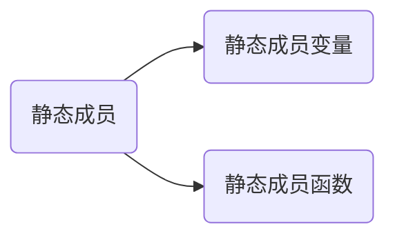
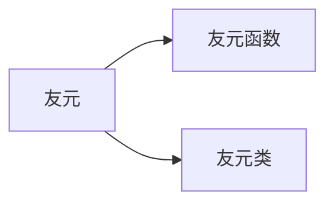

[toc]

## 🍅初始化列表

### 🥝引论

```c++
//初始化列表的引出
class B
{
public:
	B()
	{
		cout << "我是B的构造函数" << endl;
	}
private:
	int _b;
};
class A
{
public:
	A()
	{
		cout << "我是A的构造函数" << endl;
	}
private:
	int _a;
	B b;
};
int main()
{
	A a;
	return 0;
}
```


汇编验证：


### 🥝初始化列表

> c++推荐使用初始化列表进行初始化

- 什么是初始化列表？

一个冒号开始，以逗号分隔的数据成员列表，每个成员变量后面放一个括号，括号中放初始值或者表达式

> :_a(1)
>
> ,_aa(2)
>
> 这个就是初始化列表

```c++
//初始化列表使用demo
class A
{
public:
	A()
		:_a(1)//初始化列表
		, _aa(2)
	{
		cout << _a << " " << _aa << endl;
	}
private:
	int _a;
	int _aa;
};
int main()
{
	A a;
	return 0;
}
```


- 存在自定义类型时，初始化列表，不写也认为有

> 只是认为啊，不写初始化列表会在函数体之前调用自定义类型的构造函数，写了初始化列表是会进入函数体(花括号)然后调用，具体的可以观察汇编

- 成员变量只能在初始化列表里出现一次

- 成员变量包含引用和const变量时，必须在初始化列表里初始化

  > 引用和const变量必须初始化

- **成员变量的声明次序就是初始化顺序，与在初始化列表里先后顺序无关**


> 初始化列表是推荐使用的，如果初始化列表不能解决问题，混着用(在构造函数体内初始化)就行了

## 🍅explicit关键字

### 🥝引论

```c++
//int赋给对象demo
class A
{
public:
	A(int){}
};
int main()
{
	A a = 1;
	return 0;
}
```


这么写是合法的，赋值的过程发生了隐式类型转换，前提是必须有A(int这样的构造函数)

```c++
//多个int赋给对象demo
class A
{
public:
	A(int,int){}
};
int main()
{
	A a = {1,2};
	return 0;
}
```


> C++11支持多参数转换,C++98不支持

### 🥝explicit关键字使用

前面提到，int可以赋给对象是隐式类型转换，如果要禁止这种用法，则用explicit修饰对应的构造函数

```c++
//explicit使用demo
class A
{
public:
	explicit A(int){}
};
int main()
{
	A a = 1;//error
	return 0;
}
```


## 🍅static成员



<font color=green>静态成员变量：static修饰的成员变量</font>

<font color=blue>静态成员函数：static修饰的成员函数</font>

- 静态成员变量不是单单属于某一个对象的，一个类创建的多个对象使用这个静态成员变量时使用的也是同一块内存，即所有对象共有该静态成员变量

> 一份内存，多对象使用

- 静态成员函数一般用来访问静态成员，没有this指针

  > 由于没有this指针，所以无法访问非静态的成员

- 计算类的大小时不包括静态成员

  > 
  >
  > 计算类的大小可以认为是计算对象的大小，因为每个对象共有静态成员变量，所以不能认为该变量特定属于某一个对象

- 调用静态成员函数，初始化静态成员变量

```c++
//调用static函数和初始化static变量的demo
class A
{
public:
	static int Print()
	{
		cout << "static int Print()" << endl;
		return _aa;
	}
private:
	int _a;
	static int _aa;
};
int A::_aa = 1;
int main()
{
	A::Print();
	return 0;
}
```


- 静态成员变量不能给缺省值，必须在类外初始化，因为在类外初始化时才分配空间，所以不在类外初始化就不能用，用了可能会导致链接错误

- 静态成员函数不能调用非静态成员函数，非静态成员函数可以调用静态成员函数

  > 普通静态函数需要通过this指针调用，而静态成员函数没有this指针--百度

待了解：链接属性

## 🍅友元

### 🥝引论


### 🥝友元

- 什么是友元？

友元是一种定义在类外部的普通函数或类，但它需要在类体内进行说明，为了与该类的成员函数加以区别，在说明时前面加以关键字friend。--百度百科

- 友元的作用

突破封装

- 友元分类



- 友元函数解决类外重载private问题

```c++
class Date
{
	friend bool operator==(Date d1, Date d2);

private:
	int _year;
	int _month;
	int _day;
};
bool operator==(Date d1,Date d2)
{
	return d1._year == d2._year
		&& d1._month == d2._month
		&& d1._day == d2._day;
}
int main()
{
	return 0;
}
```


> 随笔记录：编译器找一些声明只会往上找
>
> 类的声明：class A;

- 如果我们在一个类内想访问另一个类的私有成员，就需要友元类

```c++
class Time
{
public:
	void GetData()
	{
		cout << d._year << d._month << d._day << endl;
	}
private:
	Date d;//借助这个对象
};
class Date
{
	friend class Time;
private:
	int _year;
	int _month;
	int _day;
};
int main()
{
	return 0;
}
```


> 友元==突破类域

## 🍅内部类

### 🥝基础概念

- 什么是内部类？

类里面定义一个类，这就叫内部类

- **内部类就是外部类的友元类**，所以内部类可以访问外部类的成员，用法也和友元类很像
- 计算类的大小时不算内部类
- 内部类内可以直接访问外部类的静态成员，不需要通过类名

- 内部类受到类域影响和访问限定符限制

### 🥝内部类的使用

```c++
//内部类使用demo
class A
{
public:
	class B
	{
	public:
		B(const A& a)
		{
			cout << "我是内部类B" << endl;
			cout << "我可以访问外部类A的变量_a:" <<a._a << endl;
		}
	private:
		int _b;
	};
	A(){}
	A(const B& b)
	{
		cout << b._b << endl;//error
	}
private:
	int _a=1;
};
int main()
{
	A a;
	A::B b(a);
	return 0;
}	
```


~~其实C++不咋用内部类，Java喜欢用内部类~~

## 🍅补充

### 🥝析构顺序例题

类A、B、C、D，问下面程序中析构函数的调用顺序？

```c++
C c;
int main()
{
	A a;
	B b;
	static D d;
	return 0;
}
```

<font color=   #0000FF>答案：析构顺序 B A D C</font>

构造顺序：C A B D

**析构顺序是D B C A吗？不是**

- 析构函数的调用时期：对象声明周期结束后

- 静态的变量存储在全局区，main函数结束后会销毁栈帧

①因为a,b都是局部对象，先构造则后析构，构造时是AB，则析构肯定是BA

> 换个角度理解，栈的特点是先进后出，那a先入栈就应该后销毁，所以b先调用析构函数

②剩下C D，C是全局对象，D是静态局部对象，这两个谁先析构？

静态局部变量先析构，全局变量C再析构

D先析构，C后析构，即DC

> 全局对象和静态局部对象的释放优先级在网上没有找到很好的解释
>
> 个人理解：CD都存在全局区，所以CD的构造顺序和析构顺序应该是相反的，即构造是CD，则析构是DC

<font color=pink>**组合①②，得到BADC**</font>

> 这种题的技巧：把局部变量作为一组，把全局和静态变量作为一组，写出两个相应的构造顺序，再逆置一下就得到相应的析构顺序，又因为局部变量先析构，再拼接两组的析构顺序得到答案

~~可以把上面那段代码拷到编译器上，然后自己写代码验证答案~~

## 🍅<font size=8>总结</font>

- 初始化列表提供了一种更好的初始化的方式，如果初始化列表不能单独完成任务，就结合构造函数体完成初始化任务

- explicit可以禁止内置类型和自定义类型的转换，具体操作就是修饰对应的构造函数
- static成员可以牵扯出很多东西，比如静态成员函数可不可以非静态变量等等，抓住关键点：静态成员函数没有this指针，static成员变量始终是一块内存，类外初始化才会分配空间
- 友元主要解决了我们在类外不能访问私有成员变量的问题，本质上破坏了封装，不建议大量使用

- 内部类，C++一般不怎么用，内部类理解为外部类的友元，同时受到访问限定符的限制，类外使用内部类得用::突破类域限制

面向对象是在模拟是在抽象模拟我们的现实世界！