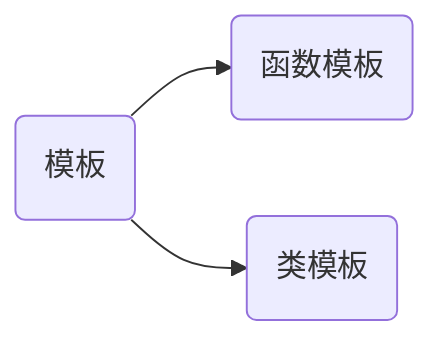
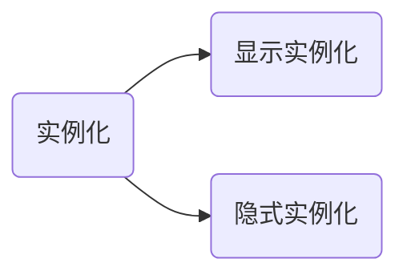

[toc]

# 🌲🌳🌴🌵C++模板

## 🌳泛型编程

### 🌵泛型是什么？

泛型是一种可以替代所有类型的通用类型

> 不使用具体类型q，使用通用类型进行编程，模板就是一个很好的使用泛型的例子
>
> 泛型，广泛的类型

### 🌵泛型编程是什么？

一种思想，编写与类型无关的通用代码，提高代码的复用性，其中模板是泛型编程的基础

> 泛型编程的思想在模板入门后会有更深的体会


## 🌳模板




### 🌴函数模板

#### 🌵引论

我们要交换整形时，要写一个swap函数,交换浮点型时，也要写一个swap,交换字符型时也要写一个swap

这里就三个swap函数了，如果三个函数同名，参数类型不同就构成了重载，但是重载归重载，还是得写三个函数，那有没有办法我们写一个函数就可以实现上述需求呢？此时便出现了函数模板

> 我们写一个函数模板，在交换int类型时，我们传入int实参，形参就被推导为int类型，传入double,形参就被推导为double,这个推导过程是编译器帮我们做的。

#### 🌵什么是函数模板？

所谓函数模板，实际上是建立一个通用函数，它所用到的数据的类型（包括返回值类型、形参类型、局部变量类型）可以不具体指定，而是用一个虚拟的类型来代替（实际上是用一个标识符来占位），等发生函数调用时再根据传入的实参来逆推出真正的类型。这个通用函数就称为函数模板（Function Template）。---百度

> 个人理解：一个模子，根据这个模子可以产生很多功能相似，但是参数类型不同的函数
>
> 另一种理解：函数模板代表了一个函数家族，该函数模板与类型无关，在使用时被参数化，根据实参类型产生函数的特定类型版本

#### 🌵实例

```c++
#include<iostream>
using namespace std;

//template<class T>
template<typename T>
void swap(T x, T y)
{
    //这个swap()函数只是一个例子，没有实现交换功能，实现交换参数得传引用
	cout << "void swap(T x, T y)" << endl;
}
int main()
{
	swap(1, 2);
	swap(1.0, 2.0);
	swap('a','b');
	return 0;
}
```


模板的格式

```c++
1.
template<class T>
返回值类型 函数名(参数列表)
2.
template<typename T>
返回值类型 函数名(参数列表) 
```

#### 🌵小结

函数模板不过是把我们要做的重复的事情交给编译器去做，提高了代码的复用性

> 随笔记录：int i(1) 这种写法是可以的，写法像类调用构造函数
>
> 类型转换==生成一个临时变量

### 🌴模板的实例化

什么是函数模板的实例化？

推演出T的类型实例化生成具体的函数



####🌵隐式实例化

隐式实例化:编译器根据实参推演模板参数的具体类型

例子


#### 🌵显式实例化

显式实例化：人为指定某种具体类型


> 存在这么一种情况 
>
> ```c++
> 
> int Add(int a, int b)
> {
> 	cout << "int Add(int , int )" << endl;
> 	return a + b;
> }
> 
> template<typename T1,typename T2>
> T1 Add(T1 t1,T2 t2)
> {
> 	cout << "T1 Add(T1,T2)" << endl;
> 	return t1 + t2;
> }
> int main()
> {
> 	Add(1, 2);//调用哪个？
> 	Add(1, 2.0);//调用哪个？
> 	return 0;
> }
> ```
>
> 
>
> 现成>半匹配>转换，不将就

### 🌴类模板

> 函数模板根据参数类型实例出具体的函数，类模板同理实例出具体的类

#### 🌵引论

我们写一个栈，里面数据类型可能都是int，或者都是double,甚至都是string，针对每种类型写一个特定的栈，调用的时候再调用相对应的栈，显然过于麻烦，那我们能不能只写一个栈就实现放任意类型的数据呢？

> 一个栈里放的数据类型应该相同，是int就都放int，不然不好开空间

#### 🌵实例

```c++
template<class T>
class A
{
public:
	void swap(T& y)
	{
		T tmp = x;
		x = y;
		y = tmp;
	}
private:
	T x;
};
int main()
{
	A<int> a;
	int y = 2;
	a.swap(y);
	cout << y << endl;
	return 0;
}
```


#### 🌵注意点

- 类模板只能显式实例化

- 类模板的名字不是真正的类，实例化的结果才是

```c++
tempalte<typename T>
class A
{
    
}
//这里A不是真正的类，A<T>才是
//比如vector<int>v1,vector<double>v2
```

- 显式实例化的参数不同，类不同

- 类里面声明，类外定义


- 模板不支持把声明写在.h,定义写到.cpp中，会引发Link Error

> 原因：编译时声明在没问题，链接时实例化找不到具体实现引发链接错误

## 🌳总结

- 泛型，就是通用的类型，泛型编程提高了代码的复用性，减少了代码量

- 模板就是泛型编程的一个例子
- 函数模板的可以隐式实例化，也可以显式实例化，看具体情况而定
- 类模板只能显式实例化
- 模板的定义和声明写在一个文件里，不然任意引发链接错误