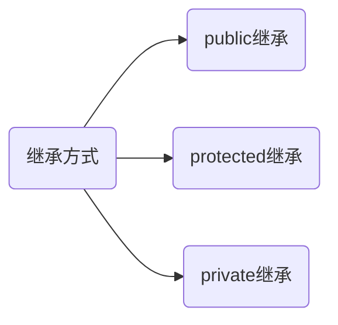
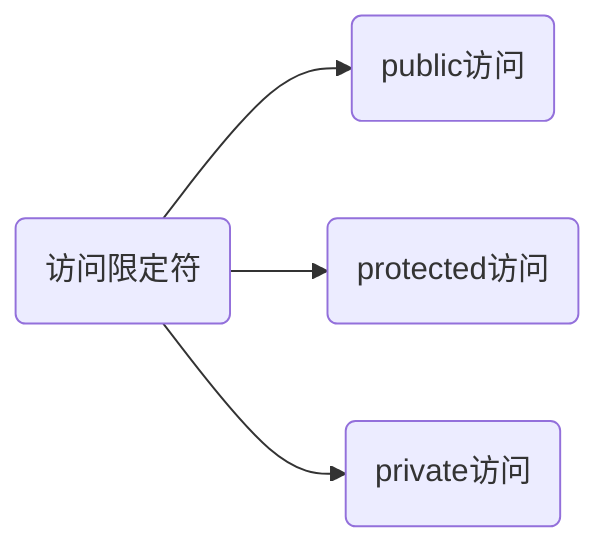

[toc]


# 🌲🌳🌴🌵🍃C++继承

## 🌳继承是什么？

继承(inheritance)机制是面向对象程序设计使代码可以复用的最重要的手段，它允许程序员在保持原有类特性的基础上进行扩展，增加功能，这样产生新的类，称派生类。

继承是C++的一个机制，可以理解为一个类从另一个类获取成员函数和成员变量的过程。--百度


## 🌳继承的作用

提高了代码的复用性和执行的效率

> 举个例子，你要做一个学校的信息管理系统，那主要的信息就是学生和老师了
>
> 没学继承前：
>
> 创一个学生类，创一个老师类，里面分别添加进相对应的属性，这个时候你会发现两者有一些相同的属性，比如都具有年龄，性别，电话号码这些属性
>
> 学会继承后：
>
> 把相同的部分提取出来放在一个类Person里，然后学生和老师类去继承Person这个类，不就能获取到年龄，性别这些属性了，而且Person类只用了一份代码，如果在两个类里分别实现就需要两份代码，相比而言就提高了代码的复用性。

## 🌳继承相关概念

- 基类/父类：提供成员变量和成员函数的类

- 派生类/子类：获取成员变量和成员函数的类

- 继承方式：public protected private

- 继承格式  class A :: public B

​     A类就是派生自B类，A就是派生类，B就是基类

> struct也可以看做类的关键字 如struct A::继承方式 B
>
> 继承不仅仅是继承成员变量，也会继承成员函数

- **继承的本质是类级别的复用**
-   class默认是私有继承 public默认是公有继承

## 🌳简单继承例子分析

```c++
class Person
{
protected:
	int _age;
	int _sex;
	string _tel;
};
class Teacher:public Person
{
private:
	string _teaid;
};
class Student :public Person
{
private:
	string _stuid;
};
```


> 随笔记录：继承是设计逻辑类似

## 🌳继承方式与访问限定符





权限大小：public>protectred>private

- public:类内和类外都能访问

- protected：该类和继承该类的类内可以访问，类外不行

- private:类内可以访问，类外不能访问

### 🌴继承基类后访问方式的变化

#### 🌵引例

```c++
//下面Derived类成员变量的访问权限各是什么
class Basic
{
public:
	int _a;
private:
	int _b;
private:
	int _c;
};
class Derived:public Basic
{
    //继承后Derived里面不仅仅只有一个_d,还有_a,_b,_C
    //请问他们的访问权限各是什么，这就是现在要讨论的问题
private:
	int _d;
};
```

#### 🌵规律

| 基类成员/继承方式   | public继承            | protected继承         | private继承         |
| ------------------- | --------------------- | --------------------- | ------------------- |
| 基类的public成员    | 派生类的public成员    | 派生类protected的成员 | 派生类private的成员 |
| 基类的protected成员 | 派生类protected的成员 | 派生类protected的成员 | 派生类private的成员 |
| 基类的private成员   | 派生类中不可见        | 派生类中不可见        | 派生类中不可见      |

两个问题

1. 观察上面的表，有啥规律？

   > public>protected>private

不考虑基类的private成员，**派生类继承自基类的成员的访问权限=min(派生类的继承方式，基类的访问权限)**

~~有点绕口~~，举个例子，基类成员访问权限是protected,继承方式是public,那么就是min(public,protected)=protected,这个protected就是在派生类中该基类成员的访问权限(访问方式）

2. 不可见是什么意思?

物理内存空间上是存在的，但是不可以使用

> 随笔记录：访问限定符限定的类外可不可以访问，不限定类内（private也可以在类内访问啊）

#### 🌵引例解答


#### 🌵小结

父类成员的访问限定符:

- public访问:给子类和类外用 
- protected访问:给子类用，不给类外用
- private访问:就是我自己（父类）的，子类和类外都不给用
- class的默认继承方式是私有继承，struct默认是公有继承，但还是建议写上继承方式

> 比如class A：B 就表示A私有继承了B

#### 🌵填坑

**在学类和对象时，为什么说protected和private是一样的？**

因为当时写的都是单独的一个类 当然只有类和类外之分

而现在学到继承，如果存在继承，说明多个类之间存在关联，此时存在的就不只是单单的类外类内，而是多了类与类的关系，比如父类的protected成员可以在子类内用，但不能在类外用，而在类和对象就没这种问题

> **protected因继承而出现**
>
> 被继承后的子类：（如果这个子类不会作为父类的话，直白点说，这个子类没有儿子）那么子类里的protected和private是一样的
>
> 其实一般都用public继承，protected和private的使用场景很少

## 🌳基类和派生类的对象赋值转换

### 🌴**切片**

我们知道基类与派生类是存在关系的，不是两个单独的类，那么他们可以相互赋值吗？

父类对象可以赋值给给子类对象吗，子类对象可以赋值给父类对象吗，父类指针/引用可以给子类吗，子类指针/引用可以给父类吗？

如果可以赋值，当两个类有相同成员变量/成员函数时，以哪一个为主？

现在我们讨论以上问题！

### 🌴要点

>  一般相同类型才可以赋值，不然就得类型转换，类型转换又分为显式类型转换和隐式类型转换，都得产生临时变量，临时变量具有常性。

- 父类对象不可以赋值给子类对象

- 子类对象可以赋值给父类对象、引用，子类的地址可以赋给父类指针，这个过程叫<font color=red>**切片**</font>,或者说切割

> 切片/切割有个前提是public继承，不然会报类型转换的错误
>
> **切片理解： **
>
> 
>
> 
>
> 


- 父类对象不能赋值给子类对象，父类指针可以强转赋值给子类指针，但是这并不安全（基类指针指向派生类对象时才安全，在多态那会用dynamic_cast来判断是否安全

### 🌴拓展

**切片/切割是一个“天然”的规则，不存在类型转换，可以用引用去测试。**

> 测试想法：把子类对象赋值给父类的引用，如果是类型转换，那么生成的中间变量具有常性，给引用就会报错（缩小了权限，这个知识点和const 引用有关），反之如果不是类型转换就不会报错

兼容赋值规则：[C++ 同名隐藏和赋值兼容规则](https://blog.csdn.net/zhengjihao/article/details/77658260?utm_source=app&app_version=5.2.0&code=app_1562916241&uLinkId=usr1mkqgl919blen)

### 🌴例子

#### 🌵**<font color=#48D1CC>例1: 父类指针作为参数接受子类对象地址/父类对象的地址</font>**


#### **<font color=#48D1CC>🌵例2: 隐藏+切片</font>**

##### 🍃隐藏/重定义

子类可以声明与父类同名的成员变量和成员函数，此时父类的同名成员将被隐藏，子类直接访问的同名成员就是自己的成员

>  注意:成员函数只要同名就构成隐藏/重定义
>
> C++虽然对同名的成员进行了处理，但是依然建议不要定义同名成员，既然这样，那我们能不能直接去掉这个机制呢？自然也是不行的，存在即合理（后面会提到

**例子**

```c++
class Basic
{
public:
	void print() 
	{
		cout << "Basic" << endl;
	}
	int _a = 0;
};
class Derived :public Basic
{
public:
	void  print()
	{
		cout << "Derived" << endl;
	}
	int _a = 1;
};
int main()
{
	Derived d;
	d.print();
	cout << d._a << endl;
	cout << endl;
	Basic b;
	b.print();
	cout << b._a << endl;
	return 0;
}
```


###### 🍁隐藏的条件下显式调用父类成员 

```c++
//显式调用
class Basic
{
public:
	void print()
	{
		cout << "Basic" << endl;
	}
};
class Derived :public Basic
{
public:
	void print()
	{
		cout << "Derived" << endl;
	}
};

int main()
{
	Derived d;
	d.Basic::print();
	return 0;
}
```


#####🍃题目

```c++
//这段代码输出什么？
class Basic
{
public:
	void print() 
	{
		cout << "Basic" << endl;
	}
	int _a = 0;
};
class Derived :public Basic
{
public:
	void  print()
	{
		cout << "Derived" << endl;
	}
	int _a = 1;
};
void func(Basic* p)
{
	p->print();
	cout <<( p->_a) << endl;
	cout << endl;
}
int main()
{
	Basic b;
	Derived d;
	b=d;
	b.print();
	d.print();
	return 0;
}
```


```c++
//testdemo
class Basic
{
public:
	void print() 
	{
		cout << "Basic" << endl;
	}
	int _a = 0;
};
class Derived :public Basic
{
public:
	void  print()
	{
		cout << "Derived" << endl;
	}
	int _a = 1;
};
void func(Basic* p)
{
	p->print();
	cout <<( p->_a) << endl;
	cout << endl; 
}
void func(Basic& p)
{
	p.print();
}
int main()
{
	
	Basic b;
	Derived d;
	
	func(&b);
	func(&d);
	func(b);
	func(d);
	return 0;
}
```


- 看到这你会发现个很奇怪的事，**两道隐藏相关的题目我都加了切片进去**，这样做有啥意义吗？

答：没有，就是之前继承刚学的时候题目都喜欢搞这套，时不时搞个切片迷惑一些 ~~其实是这块把自己搞的迷迷糊糊的，所以得好好记录一下，切片在题目里太能搞事了，虽然搞懂了也就那么回事~~

> 目前认为隐藏和切片没有关系，如果在哪块有比较深的联系麻烦指出一下！

编译器对于参数是指针的看指针类型，比如参数是父类指针的直接调用父类成员了，虽然地址是指向子类的地址，不过指向的子类对象里不也有父类的一部分。（这里没考虑多态，多态有虚表机制不一样）

> 随笔记录：继承强调的是类与类的关系 而不是对象之间的关系

##### 🍃小结

- 父子类作用域不同，所以可以存在同名变量

- 只要函数名相同就构成隐藏，隐藏不只包括成员函数
- 隐藏和切片没有关系

- 子类要调用父类被隐藏的成员需要显式调用
- 不建议定义同名，但是不能禁止，C++语法需要隐藏

## 🌳派生类的默认成员函数

> 默认的成员函数有六种，构造，析构，拷贝构造，赋值重载，取地址重载，const修饰的取地址操作符重载

这里主要讨论派生类调用构造、析构、取地址重载、赋值运算符重载时的细节，比如派生类调用构造函数时是先构造基类的构造函数还是先调用自己的构造函数

理解下面相关内容的方法：把父类看作是一个自定义成员，即把基类看作是一个整体

### 🌴构造函数

#### 🌵要点

> 类与对象那节我们知道初始化时针对内置类型不处理，对于自定义类型我们调用其构造函数，初始化的顺序跟成员的声明有关，与其在初始化列表里的顺序无关，知道这点后，我们可以把父类看作是一个已经在类外声明的自定义类型的成员

- 先调用父类的构造函数，再调用子类的构造函数。

```c++
//调用顺序demo
class Basic
{
public:
	Basic()
	{
		cout << "Basic()" << endl;
	}
};
class Derived :public Basic
{
public:
	Derived()
	{
		cout << "Derived()" << endl;
	}
};
int main()
{
	Derived d;
	return 0;
}
```


当基类没有默认构造函数时需要手动调用


如果加上成员变量呢，那就是先构造父类，再初始化成员变量（因为基类比成员变量更早声明）

> 建议不管基类有没有默认构造都在初始化列表里写上基类的构造方式

### 🌴拷贝构造

#### 🌵要点

- 编译器提供给的默认拷贝构造会调用基类的拷贝构造
- 我们自己提供的拷贝构造如果不显式调用基类的拷贝构造，会默认去调用基类的默认构造

```c++
//派生类默认的拷贝构造demo
class Basic
{
public:
	Basic()
	{
		cout << "Basic()" << endl;
	}
	Basic(Basic& )
	{
		cout << "Basic(Basic& )" << endl;
	}
};
class Derived :public Basic
{
public:
	Derived()
	{
		cout << "Derived()" << endl;
	}
};
int main()
{	
	Derived d1;
	Derived d2(d1);
	return 0;
}
```


那如果我们自己写一个派生类的拷贝构造，会发生什么？

```c++
//自己写的拷贝构造默认调用基类的默认构造还是基类的拷贝构造？
class Basic
{
public:
	Basic()
	{
		cout << "Basic()" << endl;
	}
	Basic(Basic& )
	{
		cout << "Basic(Basic& )" << endl;
	}
};
class Derived :public Basic
{
public:
	Derived()
	{
		cout << "Derived()" << endl;
	}
	Derived(Derived&)
	{
		cout << "Derived(Derived&)" << endl;
	}
};
int main()
{	
	Derived d1;
	Derived d2(d1);
	return 0;
}
```


> 拷贝构造也是构造 写了拷贝构造就不会生成默认的构造函数

既然我们知道自己写的拷贝构造函数默认会调用基类的默认构造函数，但如果存在深浅拷贝问题我们就需要自己实现，比如在派生类的拷贝构造里调用基类的拷贝构造，如：

```c++
//子类拷贝构造中手动调用父类的拷贝构造demo
class Basic
{
public:
	Basic()
	{
		cout << "Basic()" << endl;
	}
	Basic(Basic&)
	{
		cout << "Basic(Basic&)" << endl;
	}
};
class Derived:public Basic
{
public:
	Derived()
	{
		cout << "Derived()" << endl;
	}
	Derived(Derived& d)
		:Basic(d)//传进来的这个对象也得把它的基类构造了，切片行为
	{
		cout << "Derived(Derived&)" << endl;
	}
};
int main()
{
	Derived d1;
	Derived d2(d1);
	return 0;
}
```


> 如果不使用切片的方法，那编译器会调用默认的构造函数（**注意：不是拷贝构造**）

> 随笔记录：以引用为例 说明切片不是类型转换 而是一种天然行为
>
> 原因：类型转化会生成一个临时变量 临时变量具有常性  得加const 暂且不说const 我们切片是想引用得到这个子类中父类的部分  如果是类型转换 引用到的就是一个临时变量 

### 🌴析构函数

#### 🌵要点

- 子类和父类析构函数构成隐藏 ，编译器会把派生类和基类析构函数名会被处理成统一名字destructor()
- 派生类析构完会自动调用基类的析构函数，保证子类先调用析构函数进行清理，析构顺序与入栈的顺序有关，毕竟基类先构造（入栈）,自然后析构
- 

```c++
//正常析构demo
class Basic
{
public:
	Basic(){ cout << "Basic()" << endl; }
	 ~Basic()
	{
		cout << "~Basic()" << endl;
	}
};
class Derived :public Basic
{
public:
	Derived(){ cout << "Derived" << endl; }
	~Derived()
	{
		cout << "~Derived()" << endl;
	}
};
int main()
{
	Derived b;
	return 0;
}

```


> 为什么编译器要把这个基类和派生类的析构函数搞成同名构成隐藏？  
>
> 与多态有关，构成多态的条件：虚函数重写+指针/引用调用
>
> 子类和父类的析构函数如果不被处理成destructor()会发生什么？
>
> ```c++
> //可能造成内存泄漏的写法
> class Basic
> {
> public:
> 	Basic(){ cout << "Basic()" << endl; }
> 	 ~Basic()
> 	{
> 		cout << "~Basic()" << endl;
> 	}
> };
> class Derived :public Basic
> {
> public:
> 	Derived(){ cout << "Derived" << endl; }
> 	~Derived()
> 	{
> 		cout << "~Derived()" << endl;
> 	}
> };
> int main()
> {
> 	Basic* pb = new Derived;
> 	delete pb;
> 	return 0;
> }
> ```
>
> 
>
> 解决：
>
> 
>
> 
>
> ~~这个细节有点搞，语法学起来成本小高~~
>
> 
>
> > 个人理解：不存在绑定时delete调用哪个析构函数看delete的指针类型即可

### 🌴赋值重载

#### 🌵要点

- 派生类的内置类型成员值拷贝
- 自定义类型调用自己的拷贝构造
- 基类也看做一个自定义类型成员调用自己的拷贝构造

### 🌴小结

- 自己写的派生类拷贝构造不指定调用的就是基类的默认拷贝构造
- 基类和派生类的析构函数会被处理成同名构成隐藏
- 理解这几个函数时可以把基类看做一个整体（自定义类型成员）
- 切片不是类型转换，自己在写派生类的重载和拷贝构造时往往需要切片
- 先构造父类，再构造子类，先析构子类，再析构父类

## 🌳继承与友元

友元关系不会被继承

```c++
class Derived;//这一行声明不能省 不然友元函数那找不到派生类的声明
class Basic
{
	friend void func(Basic& b, Derived& d);
protected:
	int _bas=1;
};
class Derived :public Basic
{	
protected:
	int _der=2;
};
void func(Basic& b,Derived& d)
{
	cout <<b._bas<< endl;
	cout << d._der << endl;//err
}
int main()
{
	Basic b; 
	Derived d;
	func(b,d);
	return 0;
}
```


## 🌳继承与静态成员

继承与静态成员，静态成员不会被继承，而是子类和父类公用同一个 

```c++
class Basic
{
public:
	static int _bas ;
};
int Basic::_bas = 1;
class Derived:public Basic
{
	
};
int main()
{
	
	cout << Basic::_bas << endl;
	cout << Derived::_bas << endl;
	return 0;
}
```


> 静态成员变量不会被继承，而是属于共用的，其实构造函数、静态成员函数、赋值操作函数、析构函数、友元都不能被继承

## 🌳菱形继承

### 🌴单继承和多继承

单继承：一脉单传

多继承：一个类有多个父类的继承关系就叫多继承


菱形继承是多继承的一种特例


> C++支持多继承，Java不支持

### 🌴菱形继承的问题

**数据冗余和二义性**

> 以上面菱形继承的图为例，Student和Teacher里面都有一份Person成员，那Assistant继承了两个人的成员，就会导致属于Person的那部分成员有两份

```c++
class Person
{
protected:
	int _age=0;
};
class Student :public Person
{
protected:
	int _stuId;
};
class Teacher :public Person
{
protected:
	int _jobId;
};
class Assistant :public Student, public Teacher
{
public:
	void show()
	{
		cout << _age << endl;//err
		cout << Student::_age << endl;
		cout << Teacher::_age << endl;
	}
protected:
	int _courseId;
};
```


### 🌴解决菱形继承的方法

用virtual关键字构成虚继承


> virtual虚继承解决菱形继承中二义性和数据冗余的问题
>
> virtual是写在继承关系的“腰部”

### 🌴探究虚继承

> [高清图片](https://pic-1304888003.cos.ap-guangzhou.myqcloud.com/img/image-20220615175556872.png)


- 偏移量的存储是八个字节

- 冗余的变量+地址就能看到这个冗余的变量的值真实存在哪个地址   再去解引用这个地址就可以拿到冗余变量的值  

- 访问继承的虚基类对象成员_age,都是取到偏移量的位置再去计算 _age的位置（包括指针/引用等操作）

> 随笔记录： 指针是不知道自己是指向父类还是指向子类的 而他需要找到这个父类的变量给父类（切片）所以需要通过一种统一的方式去找到这个变量
>
> 为什么虚基类底层存的是地址而不直接是偏移量？看编译器实现

- 虽然解决了菱形继承，但是对象模型更加复杂，降低了一部分效率

## 🌳继承和组合

>  耦合程度：关联的程度
>
> 比如你和你爸妈就是高耦合，和陌生人就是低耦合

继承--高耦合

组合--低耦合   

因此更加推荐组合 ，因为低耦合的写法更好维护代码等 

### 🌴什么时候用组合？什么时候用继承？

根据is-a  has-a来判断用组合还是继承，都可以就选组合

如果是is-a的关系就继承，如果是has-a的关系就组合

比如Student是Person，就用继承

比如Person有一辆Car,就用组合

如果都可以就选组合（低耦合）

## 🌳结尾

如果有错误敬请指出！


